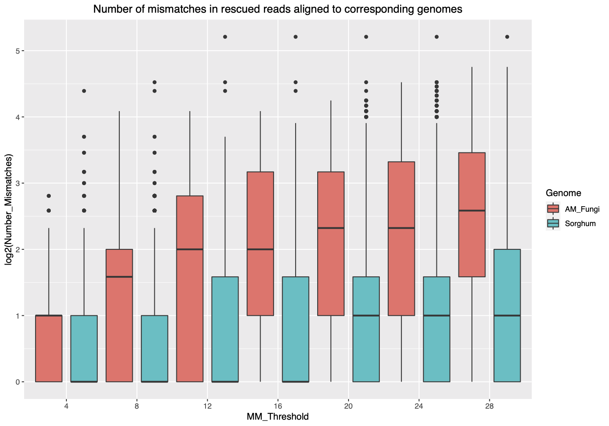
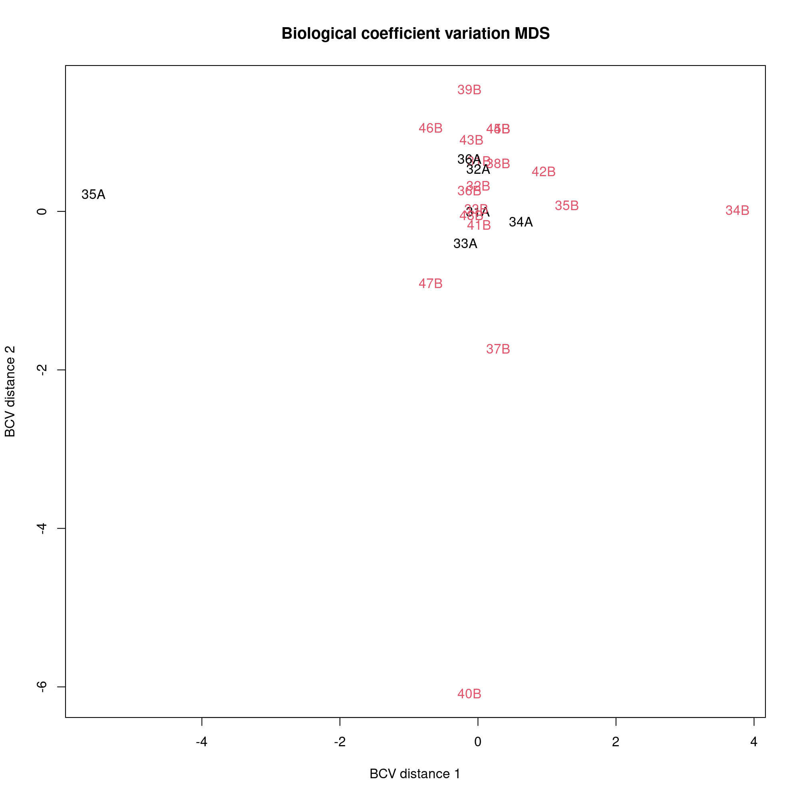
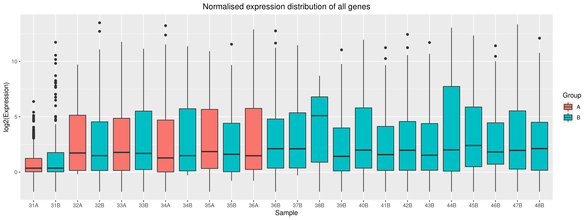
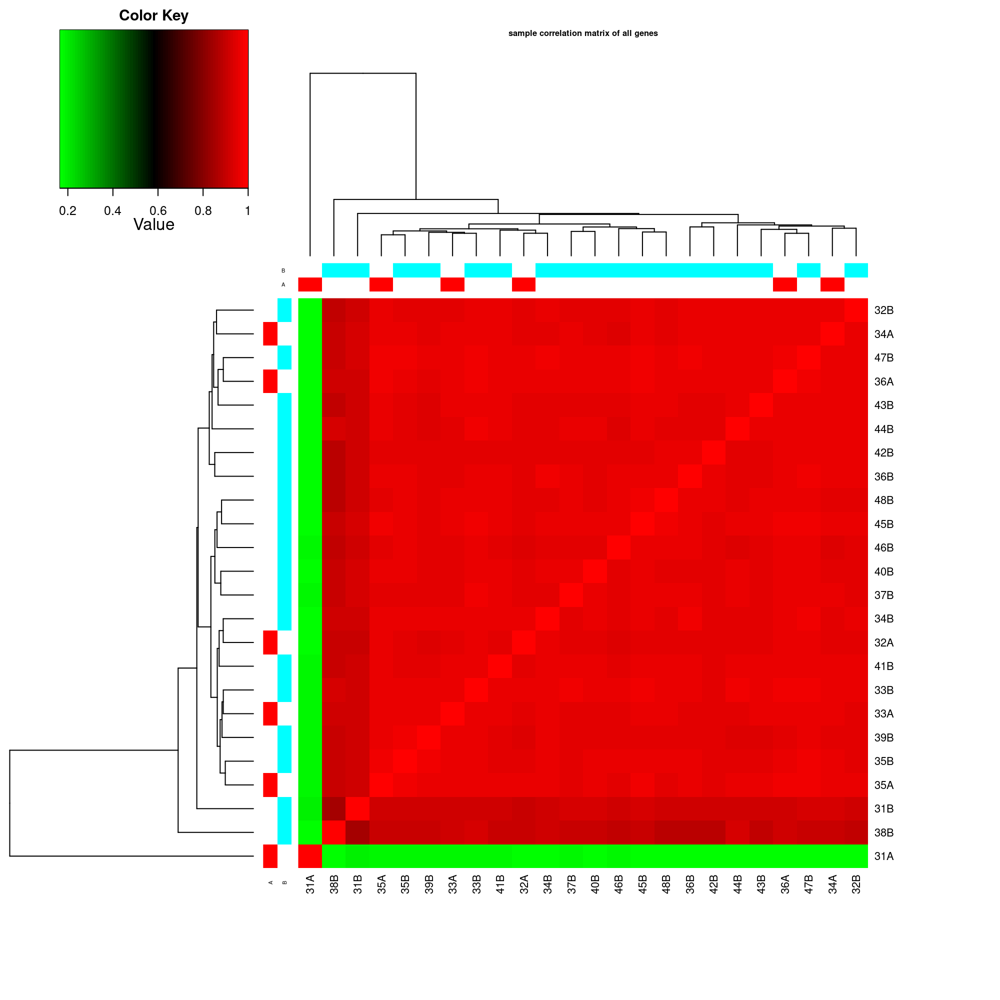
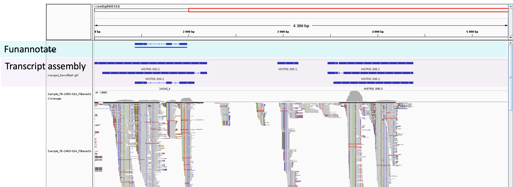
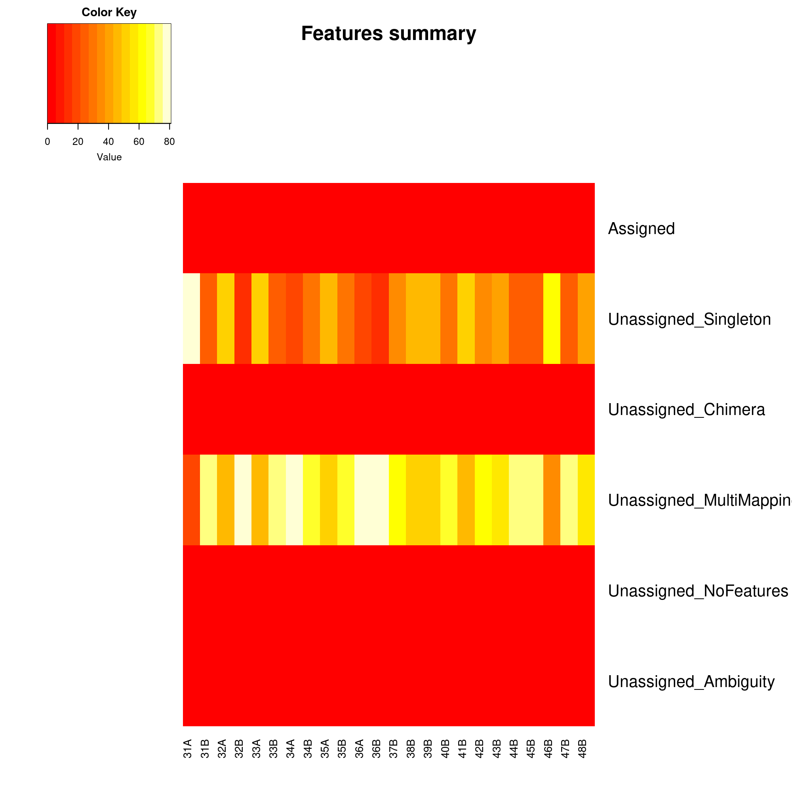

<!-- \begin{center} -->
<!-- Redmine issue:              `r params$redmine_issue` -->

<!-- NBIS staff:                 `r params$staff_name`   -->

<!-- Request by:                 `r params$requester_name`   -->

<!-- Principal investigator:     `r params$pi_name`   -->

<!-- Organisation:               `r params$organisation`   -->


<!-- \end{center} -->
<!-- \newpage -->
\vspace{0.5in}
\begin{center}
  \begin{tabular}{l r}
    Redmine issue: & `r params$redmine_issue` \\
    NBIS staff: & `r params$staff_name` (`r params$staff_mail`) \\
    Principal investigator: & `r params$pi_name`(`r params$pi_mail`) \\
    Request by: & `r params$requester_name`(`r params$requester_mail`) \\
    Organisation: & `r params$organisation` \\
    Estimated time: & `r params$estimated_time`   \\
    Used time: & `r params$used_time`   
  
  \end{tabular}
\end{center}
\newpage
\tableofcontents 
\newpage

```{r libraries, echo = FALSE}
library(ggplot2)
library(edgeR)
library(reshape2)
```

```{r Setup, echo = FALSE}
knitr::opts_chunk$set(fig.width  = 12,
                      fig.height = 8,
                      results    = "asis",
                      message    = FALSE,
                      warning    = FALSE)
```

```{r Report variables, echo = FALSE}
affil <- paste("National Bioinformatics Infrastructure Sweden, Science for",
    "Life Laboratory, Stockholm University")
link_support <- "http://nbis.se/support/support.html"
link_uppmax <- paste("http://uppmax.uu.se/support-sv/faq/general-",
    "miscellaneous-faq/acknowledging-uppmax--snic--and-uppnex")
link_authorship <- "http://www.icmje.org/recommendations/"
link_agreement <- "http://nbis.se/assets/doc/nbis-support-useragreement.pdf"
link_acknowledge <- paste("https://ngisweden.scilifelab.se/info/faq#how-do",
                          "-i-acknowledge-ngi-in-my-publication")
link_sensitive_data <- "https://nbis.se/support/human-data.html"
```

# Project information

 * Redmine issue: **`r params$redmine_issue`**
 * NBIS staff: **`r params$staff_name`**
 * Request by: **`r params$requester_name`**
 * Principal investigator: **`r params$pi_name`**
 * Organisation: **`r params$organisation`**

# Work log
The aim of this project is to improve the annotation of the genome assembly (Merce et al., 2020) by using RNA-seq data. 

 * **2020-08-11:** Meeting with the group to plan data analyses
 * **2020-10-21:** Meeting with the group about RNAseq data
 * **2020-11-10:** Meeting with David about variant quality in shared vcf files
 * **2020-12-17:** Meeting with the group about status of the RNAseq data analyzed on assembly 3n, the decision was to analyze the data on assembly1
 * **2021-02-11:** Last meeting with the group about status of the RNAseq data analyzed on assembly1

# Practical information

## Data responsibilities
Unfortunately, NBIS does not have resources to keep any files associated with
the support request; we kindly suggest that you safely store the results
delivered by us. In addition, we kindly ask that you remove the files from
UPPMAX/UPPNEX. The main storage at UPPNEX is optimized for high-speed and
parallel access, which makes it expensive and not the right place for long-term
archiving. Please be considerate of your fellow researchers by not taking up
this expensive space.

The responsibility for data archiving lies with universities and we recommend
asking your local IT for support with long-term data storage. The
[Data Center](https://www.scilifelab.se/data/) at SciLifeLab may also be
of help with discussing other options.

Please note that special considerations may apply to human-derived, sensitive
personal data. This should be handled according to specific laws and
regulations as outlined at the [NBIS website](`r link_sensitive_data`).

## Acknowledgements
If you are presenting the results in a paper, at a workshop or at a conference,
we kindly remind you to acknowledge us according to the signed
[NBIS User Agreement](`r link_agreement`):

[NBIS staff should be included as co-authors](`r params$staff_web`) if the
support work leads to a publication and when this is merited in accordance to
the ethical recommendations for authorship, *i.e.* the [ICMJE
recommendations](`r link_authorship`). If applicable, please include
*`r params$staff_name`, `r affil`* as co-author. If the above is not
applicable, please acknowledge NBIS like so: *Support by NBIS (National
Bioinformatics Infrastructure Sweden) is gratefully acknowledged.*

In addition, Uppmax kindly asks you to [acknowledge UPPMAX and
SNIC](`r link_uppmax`). If applicable, please add: *The computations were
performed on resources provided by SNIC through Uppsala Multidisciplinary
Center for Advanced Computational Science (UPPMAX) under Project
`r params$uppmax_project`.*

In any and all publications based on data from NGI Sweden, the authors
must [acknowledge SciLifeLab, NGI and Uppmax](`r link_acknowledge`), like so:
*The authors would like to acknowledge support from Science for Life
Laboratory, the National Genomics Infrastructure, NGI, and Uppmax for providing
assistance in massive parallel sequencing and computational infrastructure.*

## Closing procedures
You should soon be contacted by one of our managers, Jessica Lindvall
*(jessica.lindvall@nbis.se)* or Henrik Lantz
*(henrik.lantz@nbis.se)*, with a request to close down the project in our
internal system and for invoicing matters. If we do not hear from you within
**30 days** the project will be automatically closed and invoice sent.
Again, we would like to remind you about data responsibility and
acknowledgements, see the sections on data responsibilities and
acknowledgments.

You are naturally more than welcome to come back to us with further data
analysis request at any time via [the support form](`r link_support`). Thank
you for using NBIS, we wish you the best of luck with your future research!


# Methods
## Genome preparation
We analyzed the data on genome assembly 3n and assembly1. Results in this report is based on alignment on assembly1 and the annotation of this genome was updated by using Funannotate [@Palmer2017] by the group. 

## RNA-seq  

### QC (00-QC)  
We checked the quality of the reads by using FastQC [@Andrews] and merged the results by MultiQC[@Ewels2016].  

### Trimming (01-Trimmed_reads)  
We trimmed the reads by trimmomatic[@Bolger2014] to trim the adapters and filter low quality reads.

### Alignment (02-BAM)
We aligned trimmed reads on Sorghum and AM_fungi genome by STAR[@Dobin2012] and GSNAP[@Wu2005]. These two genomes were provided by David Manyara. We first evaluated the aligners and the results showed that GSNAP had a better statistics. Thus, all the results provided here is based on GSNAP alignment. To select species specific reads, we used Disambiguate  [@Ahdesmaki2017] and XenofilteR[@Kluin2018] tools. These tools assign reads to corresponding species based on edit distance. We evaluated performance of these tools and XenofilteR could rescue more accurate alignments. We tested different edit distances to  assign the reads.  After mapping we used QoRTs [@Hartley2015] to check the quality of the alignments. 

## Transcriptome assembly (03-Expression-Transcriptome-Assembly)
After assigning the reads to AM_fungi genome, we assembled transcriptome by StringTie [@Pertea2015] using available annotation generated by Funannotate. All the generated gtf files by StringTie were then merged. We compared the merged gtf file with the available annotation by BEDTools [@Quinlan2010]. Also, this gtf was used to extract gene expression level in all the samples.  

## Expression analysis  (03-Expression-Transcriptome-Assembly) 
We extracted fragment counts of all genes by using featurecounts[@Liao2014]. We used reads with mapping quality +20 and pairs that are properly mapped on the same contig. For downstream analysis we used edgeR[@Robinson2009]. 

All the downstream analysis and visualisation was done in R 3.6.0.

\newpage
# Results
There were 24 samples (Sorghum) incubated with AM_Fungi listed below:  
```{r echo = F}
library(captioner)
library(knitr)
library(kableExtra)
library(dplyr)
library(kableExtra)
all_samples <- data.frame(Sample = c("10A", "11A", "11B", "12A", "12B", "13A", "13B", "14A", "14B", "15A", "15B", "16A", "16B", "17B", "18A", "18B", "1B", "20A", "20B", "21A", "21B", "22A", "22B", "23A", "23B", "24A", "24B", "26A", "26B", "27B", "28A", "28B", "29A", "29B", "2A", "2B", "30A", "30B", "31B", "32A", "32B", "33A", "33B", "34A", "34B", "35A", "35B", "36A", "37A", "37B", "38A", "38B", "39A", "39B", "3A", "3B", "40A", "40B", "41A", "41B", "42A", "42B", "43B", "44A", "44B", "45A", "45B", "46A", "46B", "47A", "48A", "48B", "4A", "4B", "5A", "5B", "6A", "6B", "7A", "7B", "8A", "9A", "9B"),
                          Trimmed_paired_reads = c(26400291, 23378560, 23155791, 33922784, 30138856, 23882540, 23131823, 29321988, 25885902, 29996909, 29322601, 26161330, 26624683, 24889504, 28846830, 29603672, 47967036, 24918610, 36953800, 21479170, 30866650, 38199642, 29192604, 25820467, 28596374, 26324032, 24663223, 22702298, 30343431, 28672772, 16774016, 26582028, 18627262, 24919510, 38192445, 55878510, 15489562, 25963168, 30405701, 21132972, 36903891, 28592911, 27192272, 33302494, 27758826, 29492958, 28209350, 31472821, 30898814, 35355301, 23230254, 27676494, 29211748, 27188497, 29868312, 37944535, 19993584, 34563906, 38637115, 33230341, 34553362, 36158716, 36548792, 21256607, 36143450, 29742717, 31164207, 32714653, 38477147, 37132324, 34630060, 42409786, 38500027, 27796515, 31706139, 33683841, 32813316, 24330493, 28645178, 32828255, 23460102, 27951978, 32277478) )
samples <- data.frame(Sample = c("31A", "31B", "32A", "32B", "33A", "33B", "34A", "34B", "35A", "35B", "36A", "36B", "37B", "38B", "39B", "40B", "41B", "42B", "43B", "44B", "45B", "46B", "47B", "48B"))
samples <- merge(samples, all_samples, by = "Sample")
kable(samples, booktabs = T, caption = 'Summary of sequencing data; Number of trimmed reads.')

```

## QC 
The QC results is available in _/crex/proj/uppstore2017083/private/SMS_5123_20_AM_fungi_annotation/results/00-QC/_ 
The duplication rate is a bit high in the raw reads (Please check the multiQC report) (Figure \@ref(fig:multiqc)).
```{r multiqc, out.width = "85%", fig.align="center", fig.cap = "Fraction of duplicaetd reads.", echo = F, crop = F}
library(knitr)
include_graphics("../../results/00-QC/FastQC/Duplicate_reads.png")
```

## Trimming
By using Trimmomatic, we kept reads that both pairs survived the trimming and  reads with +36 bases length. Trimmed reads are located in   
_/crex/proj/uppstore2017083/private/SMS_5123_20_AM_fungi_annotation/data/Trimmed_reads/_ 

## Alignment
We first aligned the reads on AM_Fungi (assembly1) and Sorghum separetly. Then, we used XenofilteR with different MM_THreshould implemented in the tool to be used for filtering reads (4-28). Figure \@ref(fig:MMThreshould) shows number of mismatches in the reads assigned to corresponding genomes. Based on distribution in this figure we selected a cut-off value of 16 to filter the reads because values above 16 do not show significant improvement in terms of reliable matches and higher values will only add noise to the data.  

```{r MMThreshould, out.width = "85%", fig.align="center", fig.cap = "Distribution of nM (number of mismatches) in aligned reads after assigning to corresponding genomes. ", echo = F, crop = F}
library(knitr)

```

All the bam files are in _/crex/proj/uppstore2017083/private/SMS_5123_20_AM_fungi_annotation/results/02-BAM/_  

## Transcriptome assembly
We assembled the transcripts by using StringTie in each sample and then merged to compare with funannotate annotation. The comparison shows that there are 28 novel transcripts/genes. Merged and individual transcriptome assembly files (gtf) are located in  
_/crex/proj/uppstore2017083/private/SMS_5123_20_AM_fungi_annotation/results/03-Expression-Transcriptome-Assembly/StringTie/_  

merged_XenofilteR.gtf consists of all assembled transcripts (novel and previously annotated) and   merged_XenofilteR_unique.gtf consists of novel transcripts/genes.  


## Expression analysis  
We extracted expression values of all transcripts by using featurecounts. We used edgeR to noramlize the data and generate TMM values (trimmed mean of M-values), we checked overall expression pattern among all samples. 
Figure \@ref(fig:plotMDS) shows clustering of the samples where samples 35A and 40B are not clustered with the rest of samples. 
```{r plotMDS, out.width = "85%", fig.align="center", fig.cap = "Multidimensional scaling (MDS) plot showing expression profile and biological variation among samples.", echo = F}
library(knitr)

```
\newpage
We also checked the expression distribution of genes in all samples (Figure \@ref(fig:expressiondistribution)). The variation between samples is fairly high; for instance samples 31A, 31B and 37B behave differently. In figure \@ref(fig:expressioncorrelation) you can also see that these samples show different pattern compared to rest of the samples.  
```{r expressiondistribution, out.width = "85%", fig.align="center", fig.cap = "Expression distribution of genes across all samples. Samples are colored based on categories A and B provided in samples name.", echo = F}
library(knitr)
 
```
\newpage
```{r expressioncorrelation, out.width = "85%", fig.align="center", fig.cap = "The correlation between samples based on overall expression pattern across the genome.", echo = F}
library(knitr)
 
```


The expression profile seems to be quite variable among the samples. There are only 89 transcripts/genes where all the samples have expression values above 10 (TMM >= 10). Figure \@ref(fig:IGV) shows an example suggesting two novel genes identified on contig008316 which was not annotated by funannotate. 

```{r IGV, out.width = "85%", fig.align="center", fig.cap = "A screenshot of IGV showing read alignments of sample 31A and annotated gene by funannotate and assembled trasncripts by StringTie", echo = F}
library(knitr)
 
```
\newpage
# Concluding remarks
The pipeline implemented in this project seem to improve the assignment of reads to two different genomes (AM_Fungi and Sorghum). However, QC of the results suggest that there is a very minor improvement in annotation using RNA-seq data. One of the concern is very small fraction of reads generated from AM_Fungi in the samples. Figure \@ref(fig:featurecountssummary) shows fraction of reads that are assigned to different features on the genome. "Assigned" shows fraction of reads that are uniquely assigned to features (genes). While there are many reads that are mapped on different places which cannot be used for downstream expression analysis or annotation.  

All the scripts, this report, and results are available on Uppmax:  
_/crex/proj/uppstore2017083/private/SMS_5123_20_AM_fungi_annotation/_  

Also you can find scripts and this report and results (except bam files) on github:  
https://github.com/NBISweden/SMS_5123_20_AM_fungi_annotation

Scripts are under _doc_:  
generate_commands_GSNAP_Sorghum.sh for alignment of reads on Sorghum genome.  
generate_commands_GSNAP_assembly1.sh for alignment of reads on assembly1 genome.  

As a side note, during analysis I tried to use variant calling data generated in the group in order to identify genes with non-synonymous mutations. Some suggestions were provided to the group which can be found in email communications. 
```{r featurecountssummary, out.width = "85%", fig.align="center", fig.cap = "Summary of read assignments reported by featurecounts", echo = F}
library(knitr)
 
```
\newpage

# Reproducibility  
List of tools:  
- FastQC 0.11.9  
- MultiQC  1.9  
- Trimmomatic 0.36  
- STAR 2.7.2b  
- GSNAP gmap-gsnap/2017-09-11   
- samtools 1.10  
- QoRTs 1.3.6  
- StringTie 2.1.4  
- featureCounts 2.0.0  
- Disambiguate 1.0  
- XenofilteR 0.0.99  
- R 3.6.0  


# Sessioninfo
sessionInfo()
